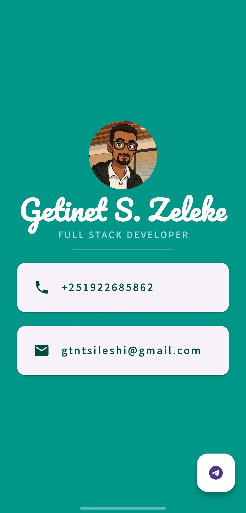

````markdown
# My Business Card Flutter App

A beautiful and responsive digital business card built using Flutter. This app showcases a profile avatar, name, title, contact details (phone and email), and includes a Telegram contact button via a floating action button.

---

## 📱 Preview



---

## ✨ Features

- Clean and elegant UI
- Displays profile avatar, name, job title
- Phone number and email in styled `Card` widgets
- Opens Telegram contact link via floating action button
- Uses local assets and custom fonts
- Launches external URLs with `url_launcher`

---

## 🛠️ Technologies Used

- **Flutter** (UI Framework)
- **Dart** (Programming Language)
- **Material Design** (UI Components)
- **url_launcher** (Flutter plugin to launch URLs)
- **Custom Fonts** (`Pacifico`, `Source Sans 3`)

---

## 📂 Project Structure

```bash
my_card_flutter/
├── assets/
│   └── images/
│       └── profile1.png
│       └── screenshot.png
├── lib/
│   └── main.dart
├── pubspec.yaml
└── README.md
````

---

## 🚀 Getting Started

### Prerequisites

* Flutter SDK (>=3.x)
* Dart SDK
* IDE (Android Studio, VS Code, etc.)

### Clone the Repo

```bash
git clone https://github.com/gtnt-sileshi/my_card_flutter.git
cd my_card_flutter
```

### Install Dependencies

```bash
flutter pub get
```

### Run the App

```bash
flutter run
```

---

## 🔤 Fonts & Assets

Add the following to your `pubspec.yaml`:

```yaml
flutter:
  assets:
    - assets/images/

  fonts:
    - family: Pacifico
      fonts:
        - asset: assets/fonts/Pacifico-Regular.ttf
    - family: Source Sans 3
      fonts:
        - asset: assets/fonts/SourceSans3-Regular.ttf
```

Ensure the font files are placed under `assets/fonts/`.

---

## 📦 Dependencies

```yaml
dependencies:
  flutter:
    sdk: flutter
  url_launcher: ^6.2.5
```

Make sure to run:

```bash
flutter pub get
```

---

## 🧪 Functionality

* The profile picture is displayed in a circular avatar.
* Name is styled with `Pacifico` font and displayed prominently.
* Job title uses `Source Sans 3` font with spacing.
* Contact information is shown using Material `Card` and `ListTile`.
* Floating Action Button launches the Telegram contact via:

```dart
launchUrl(Uri.parse('https://t.me/gtnt_slsh'));
```

---

## 🧠 Useful Notes

* The `url_launcher` package handles the external link, with graceful error handling using `SnackBar`.
* `SafeArea` ensures content doesn't overlap with device notches.
* Color theming is consistent with a teal/white palette.

---

## 📸 Screenshots

| Main Screen                         |
| ----------------------------------- |
|  |

---

## 📬 Contact

**Name**: Getinet S. Zeleke
**Phone**: +251 922 685 862
**Email**: [gtntsileshi@gmail.com](mailto:gtntsileshi@gmail.com)
**Telegram**: [@gtnt\_slsh](https://t.me/gtnt_slsh)

---

## 📝 License

This project is licensed under the MIT License. See the [LICENSE](LICENSE) file for details.

---

## 💡 Future Enhancements

* Add social media links (LinkedIn, GitHub, etc.)
* Support dark/light mode toggle
* QR code to quickly save contact
* Export to PDF / vCard

---

## ❤️ Acknowledgements

* [Flutter.dev](https://flutter.dev/)
* [url\_launcher](https://pub.dev/packages/url_launcher)
* [Google Fonts](https://fonts.google.com/)

```

```
